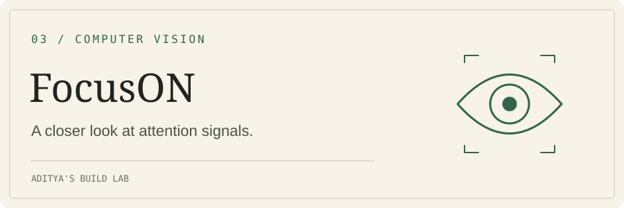

# FocusON

**What can gaze direction, blink patterns, and screen context tell us about a work session?**

FocusON is an experimental Python application that combines webcam-based gaze tracking with screenshot classification, live feedback, and saved session reports.

[See a session](#inside-a-session) · [How it works](#how-it-works) · [Run locally](#run-locally)

## Inside a session


*A session visualization already included in the repository. These are prototype signals from one session, not a validated measure of attention or productivity.*

Explore the [sample report](focuson_report_20250730_145714.txt), [sample data](focuson_data_20250730_145732.json), and [session-report format](reports/README.md).

## How it works

| Signal | What the application does |
|---|---|
| **Gaze direction** | Uses OpenCV and dlib through GazeTracking to estimate left, center, or right gaze. |
| **Blink patterns** | Establishes a 30-second baseline, then compares the current blink rate against it. |
| **Looking away** | Displays feedback when the configured five-second threshold is exceeded. |
| **Screen context** | Captures a screenshot about every 30 seconds and sends it to the OpenAI API for classification. The current source uses `gpt-4.1-mini`. |
| **Session feedback** | Displays a heuristic focus score, sends a color to a serial-connected device, and writes a report when the session ends. |

## Run locally

The current prototype expects a webcam, screen-capture access, and a serial-connected device. In `focus.py`, set `port` to your device’s path; the checked-in value is `/dev/cu.usbmodem1103` at 9600 baud. The script opens that port in its main loop, so an unavailable device will prevent normal operation.

```bash
git clone https://github.com/aditkole/FocusON.git
cd FocusON
python -m venv .venv
source .venv/bin/activate
# Windows: .venv\Scripts\activate
pip install -r requirements.txt
pip install pyserial
export OPENAI_API_KEY="your_openai_api_key_here"
python focus.py
```

`pyserial` is required by `focus.py` but is not listed in the existing requirements file. Installing `dlib` may require a local C++ toolchain and CMake. Configure the serial path before running; this is a hardware-dependent prototype.

Press **Escape** in the video window to end the session and generate a report under `reports/session_YYYYMMDD_HHMMSS/`. To compare saved sessions:

```bash
python compare_sessions.py
```

## Reading the signals

- **The score is a heuristic.** Gaze direction and blink rate do not establish whether someone is concentrating, and screen labels may misclassify useful activity.
- **Screenshots leave the device.** Screenshot classification sends screen images to the OpenAI API. The current code captures the screen rather than a selected application window.
- **Reports need care.** The current statistics code counts samples for several fields and checks whether `"PRODUCTIVE"` appears in a response, which also matches `"NON-PRODUCTIVE"`. Treat stored productivity figures as experimental outputs pending a scoring fix.
- **Good lighting helps tracking.** Webcam positioning, face visibility, and personal variation affect the signals.

## Research and attribution

Gaze tracking is built on [Antoine Lamé’s GazeTracking](https://github.com/antoinelame/GazeTracking). The repository retains [original attribution](original_attribution/README.md) and the [MIT license](LICENSE).

Background reading that informed the project:

- Goldberg, Joseph H., and Xerxes P. Kotval. “Computer Interface Evaluation Using Eye Movements: Methods and Constructs.” *International Journal of Industrial Ergonomics*, 24(6), 1999, 631–645. [DOI](https://doi.org/10.1016/S0169-8141(98)00068-7).
- Stern, John A., et al. “The Endogenous Eyeblink.” *Psychophysiology*, 21(1), 1984, 22–33. [DOI](https://doi.org/10.1111/j.1469-8986.1984.tb02312.x).

## License

[MIT](LICENSE)

---

Part of [Aditya’s Build Lab](https://github.com/aditkole).
